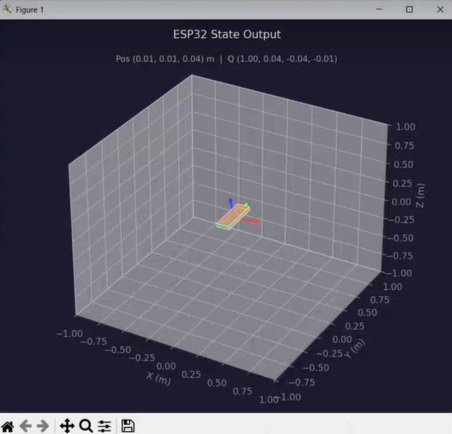

# Inertial Navigation System — ESP32-S3 + MPU6050 + GPS

A from-scratch inertial navigation system built to gain hands-on experience with state estimation. The system fuses high-rate IMU data with low-rate GPS fixes to maintain real-time estimates of position, velocity, and orientation on an ESP32-S3 microcontroller. All filter algorithms — Madgwick AHRS and a 9-state linear Kalman filter — are implemented by hand in embedded C++, without any matrix libraries.

---

## Table of Contents

- [Why Filters Are Necessary](#why-filters-are-necessary)
- [System Overview](#system-overview)
- [Hardware](#hardware)
- [Architecture](#architecture)
  - [Two-Stage Design](#two-stage-design)
  - [Coordinate Frame](#coordinate-frame)
- [Firmware](#firmware)
  - [Madgwick AHRS Filter](#madgwick-ahrs-filter)
  - [Linear Kalman Filter](#linear-kalman-filter)
  - [Sensor Calibration](#sensor-calibration)
  - [GPS Integration](#gps-integration)
  - [ZUPT — Zero Velocity Update](#zupt--zero-velocity-update)
- [Python Telemetry Viewer](#python-telemetry-viewer)
- [Results](#results)
- [Known Limitations & Next Steps](#known-limitations--next-steps)
- [Project Structure](#project-structure)

---

## Why Filters Are Necessary

### Raw Gyroscope: Orientation Drift

A gyroscope measures angular velocity. Integrating it over time gives orientation — but gyros have a small constant bias. Because you are integrating, that bias accumulates linearly. A typical MEMS gyro with even a 0.01°/s bias produces **36° of orientation error in one hour**. In practice, without correction, useful orientation tracking degrades in seconds to minutes.

### Raw Accelerometer: Position Drift

An accelerometer measures specific force (gravity + linear acceleration). Subtracting gravity gives linear acceleration, and integrating twice gives position. But accelerometer noise in a MEMS chip like the MPU6050 is on the order of **1–5 mg RMS** even at rest. Integrating noise twice (double integration) causes position error to grow quadratically with time. Even with only 1 mg of constant bias, after just 10 seconds you accumulate:

```
Δp = ½ · a · t² = ½ · (0.001 × 9.81) · 10² ≈ 0.49 m
```

After 60 seconds that's roughly **18 meters** — from noise alone, at rest. This was observed directly during development: raw double-integrated accelerometer output drifted to **~35 meters within seconds** while the board sat motionless on a table, before any GPS correction was applied. In practice, raw double-integrated position is effectively useless without correction within a few seconds.

### Raw GPS: Low Update Rate and Noise Floor

GPS provides absolute position but is slow and noisy. The NEO-6M GPS module used here updates at **4 Hz** with observed horizontal position scatter of **~12 meters** between consecutive stationary fixes in open sky. Altitude is significantly worse — errors of **±10 m or more** are typical, and the measurement noise was modeled conservatively with a 10 m standard deviation in the Kalman filter accordingly. GPS alone is far too coarse and slow for smooth real-time navigation.

### The Solution: Sensor Fusion

The Madgwick filter uses the accelerometer to continuously correct gyro drift in the pitch and roll axes. The Kalman filter fuses the fast, noisy IMU with the slow, bounded-error GPS to get estimates that are better than either sensor alone — fast updates from the IMU, and long-term stability from GPS.

---

## System Overview

```
MPU6050 (100 Hz)
  ├─ Gyroscope (deg/s) ──────────────────► Madgwick AHRS ──────────────► Quaternion (w,x,y,z)
  └─ Accelerometer (g) ──────────────────►                                       │
                                                                     rotate accel into world frame
                                                                                  │
                                                                                  ▼
NEO-6M GPS (4 Hz)                                                              Kalman Filter (100 Hz predict)
  └─ Lat / Lon / Alt ────────────────────────────────────────────────► (4 Hz GPS update)
                                                                                  │
                                                                        State: [px, py, pz,
                                                                                vx, vy, vz,
                                                                               bax, bay, baz]
                                                                                  │
                                                                                  ▼
                                                                       ENU Position Estimate
```

---

## Hardware

| Component | Details |
|-----------|---------|
| Microcontroller | ESP32-S3 |
| IMU | MPU6050 (I2C addr `0x68`, SDA=14, SCL=4) |
| GPS | NEO-6M, 4 Hz, UART (RX=18, TX=17) |
| Toolchain | PlatformIO, Arduino framework |
| IMU range | ±2g accelerometer (16384 LSB/g), ±250°/s gyro (131 LSB/°/s) |

**Hardware note:** Wires to the IMU were braided to reduce electromagnetic interference picked up as accelerometer noise — a meaningful practical improvement for MEMS sensors sensitive to common-mode noise.

---

## Architecture

### Two-Stage Design

The key architectural decision is keeping orientation **out of the Kalman state vector**. This makes the entire Kalman filter linear:

- **Stage 1 — Madgwick AHRS:** tracks a quaternion representing body-to-world orientation by fusing gyroscope integration with accelerometer-based gravity correction.
- **Stage 2 — Linear Kalman Filter:** uses that quaternion to rotate body-frame accelerations into world-frame ENU coordinates, then integrates them to propagate position and velocity. GPS provides absolute position corrections. Because both the process model (Newtonian kinematics) and the GPS measurement model (direct position observation) are linear, no Extended Kalman Filter is needed.

If orientation were included as a Kalman state, the quaternion kinematics would make the process model nonlinear, requiring an EKF with Jacobian linearization at every step. The two-stage approach avoids this entirely.

### Coordinate Frame

All positions are in **ENU (East-North-Up)** local coordinates in meters, relative to a reference point (`pNaught`) set by averaging 50 GPS fixes at startup.

---

## Firmware

### Madgwick AHRS Filter

**File:** `Madgwick.cpp`

The Madgwick filter maintains a unit quaternion `q = [w, x, y, z]` representing the rotation from body frame to world frame. Each update step has two components:

**1. Gyroscope integration:**
```
q̇_gyro = 0.5 · q ⊗ [0, ωx, ωy, ωz]
```
This propagates the quaternion forward using measured angular rates.

**2. Accelerometer gradient correction:**

The filter computes what the accelerometer *should* read if the current quaternion were correct (by rotating the world gravity vector `[0,0,0,1]` into body frame). The difference between predicted and measured acceleration is an error signal. The gradient of this error with respect to the quaternion gives the direction to adjust `q` to reduce the mismatch:

```
q̇_final = q̇_gyro - β · normalize(∇f)
```

The parameter `β` controls how much the accelerometer corrects the gyro. To avoid corrupting orientation during linear acceleration (when the accelerometer is no longer measuring only gravity), an **adaptive β** is applied:

```cpp
float a_error = fabsf(a_norm - 1.0f);
float effective_beta = beta * fmaxf(0.0f, 1.0f - a_error / 0.25f);
```

When the accelerometer magnitude strays more than 0.25g from 1.0g, the correction is reduced toward zero proportionally.

**GPS yaw correction** (`ahrs_correct_yaw`) applies a small quaternion rotation around the world Z-axis to nudge yaw toward the GPS course bearing, but only when speed exceeds 2 m/s (below that, GPS course is unreliable). This is the only source of yaw correction — accelerometers cannot observe yaw.

---

### Linear Kalman Filter

**File:** `Kalman.cpp`

#### State Vector

```
x = [px, py, pz, vx, vy, vz, bax, bay, baz]
```

Position and velocity in ENU meters / m·s⁻¹, plus accelerometer bias estimates in m·s⁻².

#### Predict Step

1. Subtract estimated bias from body-frame accelerometer readings.
2. Rotate bias-corrected acceleration into world frame using the current quaternion sandwich product: `a_world = q ⊗ [0, ax, ay, az] ⊗ q*`
3. Subtract 1.0g from the world-Z component to remove gravity, then multiply by 9.81 m/s².
4. Integrate position and velocity forward using second-order kinematics.
5. Propagate the covariance matrix using the discrete Kalman process model.

The covariance matrix is stored as three independent 3×3 symmetric matrices (one per axis), each flattened to 6 unique elements `{Ppp, Ppv, Ppb, Pvv, Pvb, Pbb}`. This avoids any matrix library while keeping the math explicit and readable.

**Process noise** is derived from acceleration standard deviation `σ_a = 0.05 m/s²` and bias random walk `σ_b ≈ 0.0005 m/s²/√s`:

```
Q_pp = σ_a² · dt⁴ / 4
Q_pv = σ_a² · dt³ / 2
Q_vv = σ_a² · dt²
Q_bb = σ_b² · dt
```

#### Update Step (GPS)

The GPS measurement model observes position directly: `H = [1, 0, 0]` per axis. The Kalman gain and state/covariance update are applied independently for East, North, and Up:

```
y  = gps_p - state_p            // innovation
S  = Ppp + R                    // innovation covariance
Kp = Ppp / S
Kv = Ppv / S                    // velocity corrected via cross-covariance
Kb = Ppb / S                    // bias corrected via cross-covariance
```

GPS measurement noise is set conservatively: `R_east = R_north = 25 m²` (5 m std dev), `R_up = 100 m²` (10 m std dev).

---

### Sensor Calibration

**File:** `Calibration.cpp`

Two calibration routines run at startup before the main loop:

**Gyroscope calibration:** 500 IMU readings are averaged while the board is stationary. The resulting integer bias is subtracted from every subsequent gyro reading, removing the DC offset before it can integrate into orientation error.

**GPS reference initialization:** 50 GPS fixes are averaged to establish `pNaught` — the ENU origin in geodetic coordinates (longitude, latitude, altitude). All subsequent GPS measurements are converted to local East-North-Up offsets relative to this point using the small-angle approximation:

```
east  = R_earth · Δlon · cos(lat₀)
north = R_earth · Δlat
up    = alt - alt₀
```

**Accelerometer calibration** uses factory-style constants derived from an external calibration script (per-axis scale factors and biases), applied during each raw read:

```cpp
accelX = (accelX - accelBiasX) * accelScaleX / 16384.0f;  // → g units
```

---

### GPS Integration

The GPS serial stream at 9600 baud is parsed continuously using **TinyGPS++** in the main loop. Kalman updates are gated behind validity and quality checks:

```cpp
if (gps.hdop.hdop() < 2.0f && gps.location.isUpdated() && gps.location.isValid())
    kalman_update(...);
```

HDOP (Horizontal Dilution of Precision) below 2.0 ensures only high-quality fixes drive the filter.

---

### ZUPT — Zero Velocity Update

When GPS confirms the device is stationary (`speed < 0.1 m/s`), a **Zero Velocity Update** is triggered. This treats the observation `v = 0` as an additional measurement, driving velocity estimates toward zero through the Kalman gain. It significantly reduces position drift buildup during stationary periods by preventing velocity error from accumulating freely.

---

## Python Telemetry Viewer

**File:** `readingSerial.py`

A Python companion script reads structured serial telemetry from the ESP32 and renders a live visualization using `matplotlib` with `FuncAnimation`. The script runs the serial reader on a background thread to avoid blocking the plot.

**Parsed telemetry lines:**

| Line format | Content |
|-------------|---------|
| `IMU -> Accel [X:... Y:... Z:...]` | Calibrated accelerometer (g) and gyro (deg/s) |
| `Quat [W:... X:... Y:... Z:...]` | Current orientation quaternion |
| `Pos [X:... Y:... Z:...]` | Kalman-estimated ENU position (m) |
| `Acceleration Biases [X:... Y:... Z:...]` | Live Kalman bias estimates |
| `GPS -> Lat:... Lon:... Alt:...` | Raw GPS fix |

The visualization renders a **single 3D view** containing both orientation and position simultaneously: a rectangular prism whose attitude is driven live by the quaternion (giving an intuitive view of pitch/roll/yaw), positioned at its Kalman-estimated ENU coordinates in 3D space so that both rotation and translation are visible in one scene.



All regex patterns are pre-compiled, sensor state is held in a persistent dict initialized to `None`, and the serial thread is wrapped in `try/except` throughout to handle disconnect gracefully.

---

## Results

### Position Tracking

When stationary, the Kalman estimate converges to within **~1 meter** of the starting position.

**What the filter can and cannot track dynamically** is ultimately bounded by the noise floor of the sensors:

- A 0.5 m hand movement happens in under a second — far too fast and small for GPS (12 m scatter) to register, and too small for IMU data to resolve cleanly above its noise floor.
- The minimum displacement that GPS can meaningfully detect is roughly **5–10 meters**.
- Movements at **10–50 m scale and above**, particularly at speeds above ~2 m/s where GPS course bearing becomes reliable for yaw correction, are where the full pipeline works as intended.

In practice, this system is better used as a position tracker at high speeds rather than for precision. The IMU's primary contribution to position is bridging the 250 ms gaps between GPS ticks with physically plausible motion, and preventing the position estimate from jumping erratically between noisy fixes. It also allows the filter to hold a reasonable position estimate for a few seconds if GPS signal is briefly lost — though IMU-only dead reckoning degrades quickly beyond that.

This is a hardware limitation, not a filter design limitation. The same Kalman architecture running on RTK GPS (which achieves 1–2 cm horizontal accuracy) would produce dramatically tighter dynamic tracking. On consumer GPS at this noise floor, the filter is doing what it can with the measurements available.

This said, the system is genuinely useful for:

- **Smooth trajectory logging** during walking, cycling, or driving — the IMU eliminates the jagged connect-the-dots appearance of raw GPS traces.
- **Attitude and tilt monitoring** — pitch and roll from the Madgwick filter are solid and useful independent of the position pipeline.
- **Short-gap dead reckoning** — maintaining a reasonable estimate across brief GPS outages (bridge underpasses, momentary obstructions).
- **Motion detection and classification** — distinguishing stationary vs. moving, detecting turns, estimating heading during vehicle-speed travel.

### Orientation Tracking

The Madgwick filter is responsive and accurate in pitch and roll with no observable drift. Yaw is the expected weak axis — without a magnetometer, the only yaw reference is integrated gyro rate (which drifts) and GPS course bearing (which is only valid above 2 m/s). At rest or low speed, slow yaw drift is present until meaningful GPS movement provides a correction. This is an inherent limitation of accelerometer+gyro-only AHRS.

Demonstration Video: [https://youtu.be/lAF7UrxtVgM](https://youtu.be/lAF7UrxtVgM)

---

## Known Limitations & Next Steps

**Current limitations:**
- Yaw drift during stationary or slow-speed operation due to absence of a magnetometer.
- Fast maneuvers are challenging due to accelerometer limits.
- Separating linear acceleration from gravitational acceleration is fundamentally difficult with a single IMU; physical mounting position matters.
- GPS altitude corrections are noisy (±10 m typical), limiting Z-axis accuracy.
- Sub-10-meter dynamic position tracking is beyond what consumer GPS hardware at this noise floor can support.

**Planned improvements:**
- Better quality GPS and IMU chips.
- Magnetometer for reliable yaw orientation tracking.
- Making position and orientation tracking more robust during aggressive maneuvers.
- Better separating acceleration from rotation — potentially through improved physical placement of the IMU on the breadboard.
- Further noise reduction and drift mitigation, possibly through magnetometer fusion for yaw or tighter process noise tuning.

---

## Project Structure

```
.
├── src/
│   ├── main.cpp           # Main loop: IMU polling, GPS parsing, timing, telemetry
│   ├── Kalman.cpp         # 9-state linear Kalman filter (predict, GPS update, ZUPT)
│   ├── Madgwick.cpp       # Madgwick AHRS quaternion filter + GPS yaw correction
│   ├── Calibration.cpp    # Startup gyro calibration + GPS reference averaging
│   └── QuatFxns.cpp       # Quaternion multiply and normalize utilities
├── include/
│   ├── Kalman.h
│   ├── Madgwick.h
│   ├── Calibration.h
│   └── QuatFxns.h
└── readingSerial.py       # Python live visualizer (3D orientation + position)
```
